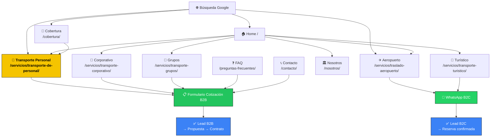

# PRD — Mayhil Express

| Campo | Valor |
|-------|-------|
| **Proyecto** | Mayhil Express |
| **Tipo** | Web Corporativa B2B — Generación de Leads |
| **Dominio** | mayhilexpress.com |
| **Cliente** | Iván Mayorga — Director de Operaciones |
| **Contacto** | +51 941 747 096 · servicio@mayhilexpress.com |
| **Fecha** | 2026-06-17 |
| **Versión** | 3.0 — Conforme a metodología del sistema |
| **Estado** | Aprobado internamente · Pendiente validación cliente |
| **Blueprints aplicados** | 02_WEB_CORPORATIVA + 05_GENERACION_DE_LEADS |
| **Agentes responsables** | 01_JEFE_DE_PROYECTO_IA + 03_ARQUITECTO_WEB |
| **Input** | 01_BRIEF_CLIENTE.md v3.1 (Cerrado · Validado) |

---

# PARTE I — JEFE DE PROYECTO IA

> Responsabilidad: Alcance, objetivos, riesgos, roadmap, coordinación de agentes.

---

## 1. Resumen Ejecutivo

Mayhil Express es una empresa de movilidad corporativa con 5 años de operación en Lima, Perú. El 70% de sus ingresos proviene de contratos B2B de Transporte de Personal para empresas. El restante 30% proviene de traslados aeroportuarios (20%) y turismo (10%).

El proyecto consiste en construir un sitio web corporativo orientado a **generar solicitudes de cotización empresarial** de Gerentes de RRHH, Administración y Logística. La web debe posicionar a Mayhil Express como proveedor formal y confiable de movilidad corporativa, diferenciado por monitoreo GPS, cobertura regional (Lima + Ica, Pisco, Huacho) y referencias de empresas como SEDAPAL, CLARO y MOVISTAR.

**CTA primario:** Formulario de cotización B2B.
**CTA secundario:** WhatsApp (para segmento B2C — aeropuerto y turismo).

---

## 2. Estado del Proyecto

| Fase | Estado | Responsable |
|------|--------|-------------|
| Brief | ✅ Completado (v3.1) | 02_ESTRATEGA_DE_NEGOCIO |
| PRD | ✅ En curso | 01_JEFE_DE_PROYECTO_IA + 03_ARQUITECTO_WEB |
| Sitemap | ✅ Incluido en este PRD | 03_ARQUITECTO_WEB |
| SEO Plan | ✅ Completado | 06_EXPERTO_SEO |
| Wireframes | ✅ Completado | 04_UX_UI_DESIGNER |
| Copy | ✅ Completado | 05_COPYWRITER_WEB |
| Desarrollo WordPress | ⏳ Pendiente | 08_WORDPRESS_DEVELOPER |
| QA | ⏳ Pendiente | 10_QA_MANTENIMIENTO |
| Lanzamiento | ⏳ Pendiente | 11_DEVOPS_DEPLOYMENT |

---

## 3. Objetivos del Proyecto

### Objetivo principal (SMART)

> Generar un mínimo de **3 solicitudes de cotización empresarial por mes** vía formulario B2B durante los primeros 90 días post-lanzamiento, provenientes de empresas con operaciones en Lima o regiones.

### Objetivos secundarios

| # | Objetivo | Criterio de éxito | Plazo |
|---|----------|------------------|-------|
| 1 | Posicionamiento B2B en Google | Top 10 en 2+ keywords corporativas | 90 días |
| 2 | Contactos B2C via WhatsApp | ≥ 10 clics/mes al widget de WhatsApp | 30 días |
| 3 | Credibilidad institucional | Sección social proof activa al lanzamiento | Día 0 |
| 4 | Imagen profesional | Sitio percibido mejor que los 3 competidores referenciados | Día 0 |
| 5 | Cobertura regional visible | Página `/cobertura/` publicada con Lima + Ica/Pisco/Huacho | Día 0 |

---

## 4. Alcance del Proyecto

### Dentro del alcance — Fase 1

- [x] Sitio web corporativo completo — 10 páginas en español
- [x] Versión en inglés — 9 páginas equivalentes
- [x] Formulario de cotización B2B con campos empresariales (9 campos)
- [x] Widget WhatsApp flotante con mensajes diferenciados por audiencia
- [x] Sección "Empresas que confían en nosotros" (SEDAPAL/CLARO/MOVISTAR + fallback)
- [x] Página de cobertura geográfica (Lima + Ica, Pisco, Huacho)
- [x] SEO on-page con Rank Math (meta titles, descriptions, schema, sitemap XML)
- [x] Google Analytics 4 + Google Tag Manager
- [x] Tracking de eventos: formulario enviado + clic WhatsApp
- [x] Responsive / Mobile-first

### Fuera del alcance — Fase 1

- [ ] Ecommerce / WooCommerce
- [ ] Pasarela de pago
- [ ] Sistema de reservas automático
- [ ] Área privada / login de clientes
- [ ] CRM conectado
- [ ] Blog (Fase 2 — opcional)
- [ ] Landing pages para Ads (Fase 2 — opcional)

---

## 5. Funcionalidades — Lista Priorizada

| # | Funcionalidad | Prioridad | Plugin / Herramienta | Fase |
|---|---------------|-----------|----------------------|------|
| 1 | Formulario cotización B2B (9 campos empresariales) | **CRÍTICA** | Fluent Forms | 1 |
| 2 | Widget WhatsApp flotante (mensajes diferenciados) | Alta | WP Social Chat | 1 |
| 3 | Multiidioma ES / EN | Alta | WPML o Polylang | 1 |
| 4 | Galería de flota con especificaciones (H350) | Alta | ACF + Elementor | 1 |
| 5 | Sección social proof "Empresas que confían" | Alta (condicional) | Elementor Global | 1 |
| 6 | Página de cobertura con mapa embed | Alta | Google Maps + Elementor | 1 |
| 7 | SEO on-page completo + Schema markup | Alta | Rank Math | 1 |
| 8 | GA4 + GTM + eventos formulario/WhatsApp | Alta | GTM | 1 |
| 9 | Header sticky con CTA "Solicitar cotización" | Alta | Elementor Theme Builder | 1 |
| 10 | Footer global con info de contacto | Media | Elementor Theme Builder | 1 |
| 11 | FAQ con accordion en página dedicada | Media | Elementor Accordion | 1 |
| 12 | Breadcrumbs en subpáginas | Media | Rank Math | 1 |
| 13 | Sitemap XML enviado a Search Console | Alta | Rank Math | 1 |
| 14 | Blog | No | — | 2 |
| 15 | Landing Ads dedicada | No | — | 2 |

---

## 6. Gestión de Riesgos

### Riesgos de negocio

| Riesgo | Probabilidad | Impacto | Mitigación |
|--------|:---:|:---:|------------|
| Autorización SEDAPAL/CLARO/MOVISTAR no llega antes del lanzamiento | Media | Alto | Preparar fallback con texto genérico — no retrasar lanzamiento |
| Cliente B2C puede diluir posicionamiento B2B | Media | Medio | Arquitectura separada: formulario B2B / WhatsApp B2C |
| Sin presencia digital actual que aporte autoridad de dominio | Alta | Medio | Empezar a construir autoridad desde lanzamiento: GBP + contenido + citaciones |

### Riesgos de contenido

| Riesgo | Probabilidad | Impacto | Mitigación |
|--------|:---:|:---:|------------|
| Cliente no entrega materiales a tiempo (fotos, textos, logo) | Alta | Alto | Solicitar todo en sesión de onboarding pre-inicio |
| Testimonios no disponibles al lanzamiento | Alta | Medio | Lanzar con social proof de empresa (SEDAPAL/CLARO/MOVISTAR) o fallback |
| Precios no confirmados para B2C | Media | Bajo | Publicar "cotización a medida" sin precios fijos |

### Riesgos de SEO

| Riesgo | Probabilidad | Impacto | Mitigación |
|--------|:---:|:---:|------------|
| Resultados orgánicos lentos (3–6 meses normales) | Alta | Bajo | Alinear expectativas con el cliente desde el inicio |
| Competidores con más dominio authority | Media | Medio | Keywords regionales de baja competencia + long tail B2B |
| Duplicación ES/EN sin hreflang | Media | Medio | Configurar hreflang correctamente via WPML/Polylang |

### Riesgos técnicos

| Riesgo | Probabilidad | Impacto | Mitigación |
|--------|:---:|:---:|------------|
| Hosting inadecuado para WordPress + Elementor | Media | Alto | Confirmar hosting antes de instalar — mínimo 2GB RAM, PHP 8.1 |
| Accesos a dominio/hosting no entregados | Media | Alto | Solicitar todos los accesos en onboarding |
| Core Web Vitals bajos por imágenes no optimizadas | Media | Medio | WebP obligatorio + LiteSpeed Cache + Cloudflare |

---

## 7. Roadmap del Proyecto

```
FASE 1 — SETUP (Día 1)
  └── Instalación WordPress + stack base + configuración inicial

FASE 2 — HOME + CORE (Días 2–4)
  └── Home completo (Hero, Servicios, Diferenciadores, Social Proof, Formulario B2B, Flota, Cobertura)
  └── Formulario de cotización B2B funcional + notificaciones

FASE 3 — PÁGINA CRÍTICA (Días 3–5)
  └── /servicios/transporte-de-personal/ (GPS, Cobertura, Social Proof, Formulario embebido)

FASE 4 — PÁGINAS SECUNDARIAS (Días 5–7)
  └── Nosotros + Cobertura + Corporativo + Aeropuerto + Turístico + Grupos + FAQ + Contacto

FASE 5 — MULTIIDIOMA (Días 7–9)
  └── Versión EN — 9 páginas equivalentes

FASE 6 — SEO ON-PAGE (Día 9)
  └── Rank Math: meta titles, descriptions, schema, breadcrumbs, sitemap XML

FASE 7 — INTEGRACIONES (Día 10)
  └── GA4 + GTM + tracking formulario + WhatsApp + Search Console

FASE 8 — QA (Día 11)
  └── Responsive, velocidad, formulario, enlaces, cross-browser

FASE 9 — LANZAMIENTO (Día 12–13)
  └── Deploy a producción + GBP + configuración DNS

FASE 10 — POST-LANZAMIENTO (Día 14+)
  └── Monitoreo, correcciones, primeros reportes SEO
```

**Tiempo total estimado:** ~13–14 días hábiles
*(Baseline blueprint Web Corporativa: 5–15 días según complejidad)*

---

## 8. Agentes Involucrados

| Agente | Responsabilidad | Estado |
|--------|----------------|--------|
| 02_ESTRATEGA_DE_NEGOCIO | Brief v3.1 — validación estratégica completa | ✅ |
| 01_JEFE_DE_PROYECTO_IA | PRD, alcance, riesgos, roadmap | ✅ |
| 03_ARQUITECTO_WEB | Arquitectura, sitemap, stack, Mermaid | ✅ |
| 06_EXPERTO_SEO | SEO Plan, keywords, schema, roadmap SEO | ✅ |
| 04_UX_UI_DESIGNER | Wireframes, Design System, Prompt Stitch | ✅ |
| 05_COPYWRITER_WEB | Copy completo ES + EN, CTAs, FAQs | ✅ |
| 08_WORDPRESS_DEVELOPER | Desarrollo WordPress + Elementor + plugins | ⏳ |
| 10_QA_MANTENIMIENTO | Testing, checklist, validación final | ⏳ |
| 11_DEVOPS_DEPLOYMENT | Deploy, DNS, entorno de producción | ⏳ |

---

## 9. Próxima Acción

**Agente activo:** `08_WORDPRESS_DEVELOPER`

**Inputs disponibles:**
- `01_BRIEF_CLIENTE.md` v3.1
- `02_PRD.md` (este documento)
- `03_SEO_PLAN.md`
- `04_WIREFRAMES.md`
- `05_COPY.md`

**Acción inmediata:**
Iniciar setup de WordPress en hosting confirmado e instalar stack base (Elementor Pro, Rank Math, Fluent Forms, ACF, WPML/Polylang, WP Social Chat, GTM Plugin, LiteSpeed Cache, Cloudflare).

**Prerrequisito crítico:** Confirmar con el cliente: hosting, acceso al dominio, accesos Google (GA4, Search Console, GTM) y autorización SEDAPAL/CLARO/MOVISTAR.

---

# PARTE II — ARQUITECTO WEB

> Responsabilidad: Arquitectura de información, sitemap, flujos de usuario, stack técnico, Mermaid, URLs.

---

## 10. Resumen Arquitectónico

**Tipo de proyecto:** Web Corporativa B2B-first con componente de Generación de Leads
**Blueprint principal:** `02_WEB_CORPORATIVA.md`
**Blueprint secundario:** `05_GENERACION_DE_LEADS.md`
**Patrón de conversión del blueprint:** `Home → Servicio → Formulario → CRM/WhatsApp → Lead`

**Decisión arquitectónica crítica:**
La página `/servicios/transporte-de-personal/` es la página pilar del proyecto. Concentra el 70% del valor del negocio, el mayor esfuerzo de contenido y la inversión SEO principal. Toda la arquitectura irradia desde esta página.

---

## 11. Sitemap Completo

### Español (principal)

```
/                                           → Home
├── /nosotros/                              → Nosotros
├── /servicios/
│   ├── /servicios/transporte-de-personal/  → Transporte de Personal ★ PILAR
│   ├── /servicios/transporte-corporativo/  → Transporte Corporativo
│   ├── /servicios/traslado-aeropuerto/     → Traslado Aeropuerto
│   ├── /servicios/transporte-turistico/    → Transporte Turístico
│   └── /servicios/transporte-grupos/       → Transporte para Grupos
├── /cobertura/                             → Zonas de Cobertura ★ NUEVA
├── /preguntas-frecuentes/                  → Preguntas Frecuentes
└── /contacto/                              → Contacto
```

**Total español: 10 páginas**

### Inglés (secundaria)

```
/en/                                        → Home EN
├── /en/about/                              → About Us
├── /en/services/
│   ├── /en/services/staff-transport/       → Staff Transport ★ PILAR EN
│   ├── /en/services/airport-transfer/      → Airport Transfer
│   └── /en/services/tour-transport/        → Tour Transport
├── /en/coverage/                           → Coverage Areas
├── /en/faq/                                → FAQ
└── /en/contact/                            → Contact
```

**Total inglés: 9 páginas** *(versión EN más compacta — ver decisión en sección 18)*

**Total global: 19 páginas**

---

## 12. Arquitectura de Información

### Jerarquía de contenidos

| Nivel | Página | Keyword objetivo | Tipo de contenido |
|-------|--------|-----------------|-------------------|
| 1 — Hub | Home `/` | transporte de personal lima | Presentación + distribuidor |
| 2 — Pilar | Transporte Personal | transporte de personal lima | Servicio profundo + GPS + cobertura + formulario |
| 2 — Pilar | Cobertura | cobertura lima ica pisco huacho | Diferenciador geográfico |
| 3 — Servicio | Corporativo | transporte corporativo lima | Servicio B2B complementario |
| 3 — Servicio | Aeropuerto | traslado aeropuerto lima | Servicio B2C principal |
| 3 — Servicio | Turístico | transporte turístico lima | Servicio B2C complementario |
| 3 — Servicio | Grupos | transporte privado grupos lima | Capacidad diferenciadora |
| 4 — Soporte | Nosotros | empresa transporte lima 5 años | E-E-A-T + confianza |
| 4 — Soporte | FAQ | preguntas transporte personal | Long tail + objeciones |
| 4 — Conversión | Contacto | cotizar transporte personal lima | CTA directo |

### Módulos activados (Blueprint Web Corporativa)

**Core (obligatorios):**
- [x] Home
- [x] Nosotros
- [x] Servicios (hub + 5 páginas de servicio)
- [x] Contacto

**SEO (opcionales activados):**
- [x] FAQs
- [ ] Blog (Fase 2)
- [ ] Casos de éxito (pendiente — reemplazado por social proof inline)

**Corporativo (opcionales activados):**
- [x] Clientes / Social proof (SEDAPAL/CLARO/MOVISTAR)
- [x] Testimon. sugeridos (plantillas disponibles en 05_COPY.md)
- [ ] Equipo (PENDIENTE DE VALIDACIÓN — fotos y datos del equipo)
- [ ] Certificaciones (PENDIENTE DE VALIDACIÓN)

**Internacional:**
- [x] Multiidioma ES / EN

**Leads:**
- [x] Formulario B2B (9 campos)
- [x] WhatsApp flotante
- [ ] Landing Pages Ads (Fase 2)

---

## 13. Flujo de Usuario

### Flujo B2B (primario — 70% del negocio)

```
[Google] "transporte de personal lima"
         ↓
[Página] /servicios/transporte-de-personal/
         ↓
[Ve] GPS diferenciador + SEDAPAL/CLARO/MOVISTAR + cobertura Lima+regiones
         ↓
[Lee] "Sin permanencia mínima — prueba el servicio sin compromisos"
         ↓
[Acción] Completa formulario de cotización (9 campos empresariales)
         ↓
[Sistema] Notificación email a servicio@mayhilexpress.com
         ↓
[Mayhil] Responde con propuesta en <24 horas
         ↓
[Resultado] Primer servicio → cliente recurrente
```

### Flujo B2C (secundario — 30% del negocio)

```
[Google] "traslado aeropuerto lima" / "tour privado lima"
         ↓
[Página] /servicios/traslado-aeropuerto/ o /servicios/transporte-turistico/
         ↓
[Ve] Vehículo H350 + disponibilidad 24/7 + espacio para equipaje
         ↓
[Acción] Clic en botón WhatsApp con mensaje preconfigurado
         ↓
[Resultado] Reserva confirmada por WhatsApp
```

### Flujo navegacional (alternativo)

```
[Google/Referido] → Home
                   ↓
        [Navega] Servicios → /servicios/transporte-de-personal/ (★)
                   ↓
        [Alternativa] FAQ → responde objeciones → regresa al formulario
                   ↓
        [Alternativa] Cobertura → confirma zona → formulario
```

---

## 14. Arquitectura SEO — Resumen

*(Detalle completo en `03_SEO_PLAN.md`)*

### Clusters principales

| Cluster | Página pilar | Keyword pilar | Prioridad |
|---------|-------------|--------------|-----------|
| Transporte de Personal | /servicios/transporte-de-personal/ | transporte de personal lima | ★★★★★ |
| Cobertura Regional | /cobertura/ | cobertura transporte lima ica pisco | ★★★★★ |
| Aeropuerto | /servicios/traslado-aeropuerto/ | traslado aeropuerto lima | ★★★★☆ |
| Corporativo | /servicios/transporte-corporativo/ | transporte corporativo lima | ★★★☆☆ |
| Turismo | /servicios/transporte-turistico/ | transporte turístico lima | ★★★☆☆ |

### Schema markup por página

| Página | Schema |
|--------|--------|
| Home | `Organization` + `LocalBusiness` (TransportService) + `WebSite` |
| Páginas de servicio | `Service` |
| FAQ | `FAQPage` + `Question` + `AcceptedAnswer` |
| Cobertura | `LocalBusiness` con `areaServed` (Lima, Ica, Pisco, Huacho) |
| Todas las subpáginas | `BreadcrumbList` |

### SEO Local

- Google Business Profile: crear/reclamar — **ACCIÓN INMEDIATA**
- Categoría GBP: "Transportation service"
- Área de servicio: Lima Metropolitana + Ica + Pisco + Huacho

---

## 15. Arquitectura Técnica — Stack

### Stack oficial del proyecto

*(Basado en DECISIONES_ARQUITECTONICAS.md + Blueprint 02_WEB_CORPORATIVA.md)*

| Capa | Herramienta | Decisión del sistema |
|------|-------------|---------------------|
| CMS | WordPress | Decisión 01 — Aceptada |
| Page Builder | Elementor Pro | Decisión 02 — Aceptada |
| SEO | Rank Math | Decisión 09 — Aceptada |
| Campos custom | ACF (Advanced Custom Fields) | Blueprint Web Corporativa |
| Formularios | Fluent Forms | Blueprint Web Corporativa |
| Multiidioma | WPML (preferido) o Polylang | — |
| WhatsApp | WP Social Chat | — |
| Analytics | Google Analytics 4 vía GTM | Decisión 10 — Aceptada |
| Tag Manager | Google Tag Manager | Decisión 11 — Tracking |
| CDN / Seguridad | Cloudflare | Stack oficial del sistema |
| Caché / Performance | LiteSpeed Cache | Stack oficial del sistema |
| Control de versiones | GitHub | Decisión 06 — Aceptada |
| Hosting | PENDIENTE DE VALIDACIÓN | — |

### Uso de ACF en este proyecto

| Campo ACF | Tipo | Usado en |
|-----------|------|---------|
| Flota — Nombre del vehículo | Texto | Página Flota / Nosotros |
| Flota — Capacidad | Número | Página Flota / Servicios |
| Flota — Especificaciones | Repeater | Página Flota |
| Flota — Galería | Galería | Todas las páginas de servicio |
| Servicio — Icono | Imagen | Tarjetas de servicio |
| Servicio — CTA tipo | Select (B2B/B2C) | CTAs dinámicos por servicio |

### Nota sobre JetEngine / Crocoblock

El sistema tiene disponible Crocoblock/JetEngine (Decisión 03). Para este proyecto **no se activa** — la complejidad dinámica es baja y ACF + Elementor Pro es suficiente. Si en Fase 2 se agrega un directorio de zonas de cobertura dinámico, se puede activar JetEngine.

---

## 16. Integraciones

| Integración | Prioridad | Estado | Acción del cliente |
|-------------|-----------|--------|--------------------|
| Google Analytics 4 | Alta | Pendiente | Crear cuenta o dar acceso |
| Google Search Console | Alta | Pendiente | Verificar dominio |
| Google Tag Manager | Alta | Pendiente | Crear contenedor |
| Google Business Profile | Alta | **URGENTE** | Crear/reclamar perfil |
| Google Maps (embed /cobertura/) | Media | Pendiente | No requiere del cliente |
| WhatsApp Business (+51 941 747 096) | Alta | Confirmar | Confirmar número activo |
| Email (notif. formulario) | Alta | Pendiente | Confirmar email destino |
| Meta Pixel | Baja | Fase 2 | — |

---

## 17. Arquitectura — Diagrama Mermaid

*(Obligatorio según Decisión 12 del sistema)*



---

## 18. Estructura de URLs

| Página | URL | Keyword en URL | Nivel |
|--------|-----|:-:|:---:|
| Home ES | `/` | — | 1 |
| Nosotros | `/nosotros/` | — | 2 |
| Transporte Personal | `/servicios/transporte-de-personal/` | ✓ | 3 |
| Transporte Corporativo | `/servicios/transporte-corporativo/` | ✓ | 3 |
| Traslado Aeropuerto | `/servicios/traslado-aeropuerto/` | ✓ | 3 |
| Transporte Turístico | `/servicios/transporte-turistico/` | ✓ | 3 |
| Transporte Grupos | `/servicios/transporte-grupos/` | ✓ | 3 |
| Cobertura | `/cobertura/` | ✓ | 2 |
| FAQ | `/preguntas-frecuentes/` | — | 2 |
| Contacto | `/contacto/` | — | 2 |
| Home EN | `/en/` | — | 1 |
| About | `/en/about/` | — | 2 |
| Staff Transport | `/en/services/staff-transport/` | ✓ | 3 |
| Airport Transfer | `/en/services/airport-transfer/` | ✓ | 3 |
| Tour Transport | `/en/services/tour-transport/` | ✓ | 3 |
| Coverage | `/en/coverage/` | — | 2 |
| FAQ EN | `/en/faq/` | — | 2 |
| Contact EN | `/en/contact/` | — | 2 |

**Reglas de URL aplicadas (sistema):**
- Minúsculas sin tildes ni caracteres especiales
- Guiones medios como separadores (sin guiones bajos)
- Keyword principal incluida en el slug donde es posible
- Máximo 3-4 palabras por slug
- Versión EN: prefijo `/en/` gestionado por WPML

**Decisión arquitectónica — Versión EN compacta:**
La versión EN fusiona "Transporte Corporativo" y "Transporte para Grupos" dentro de "Staff Transport" (`/en/services/staff-transport/`). Razón: concentra autoridad SEO en una sola página pilar en inglés y simplifica la experiencia para usuarios angloparlantes que principalmente buscan empresas de B2B transport o airport transfer.

---

# PARTE III — ESPECIFICACIÓN DE PÁGINAS

---

## 19. Páginas — Especificación Técnica

### 19.1 Home (`/`)

| Campo | Valor |
|-------|-------|
| Keyword H1 | transporte de personal lima |
| Meta title | Transporte de Personal y Movilidad Corporativa en Lima \| Mayhil Express |
| Meta description | Empresa de transporte de personal para empresas en Lima con GPS en tiempo real. 24/7 · 17 pax · Lima, Ica, Pisco y Huacho. Sin permanencia mínima. Solicita cotización. |
| Schema | Organization + LocalBusiness (TransportService) + WebSite |
| CTA primario | Formulario B2B (embebido en la página) |
| CTA secundario | WhatsApp B2C |
| Módulo clave | Sección social proof SEDAPAL/CLARO/MOVISTAR |

**Secciones en orden:**
1. Header sticky (global)
2. Hero B2B — Headline + foto H350 + 2 CTAs
3. Trust bar — 5 íconos (GPS · 24/7 · 17 pax · Lima+regiones · 5 años)
4. Servicios — 5 tarjetas B2B-first (Personal destacada)
5. Diferenciadores — 6 bloques (GPS, capacidad, 24/7, cobertura, sin contrato, bilingüe)
6. Social proof — logos SEDAPAL/CLARO/MOVISTAR (condicional) o texto fallback
7. Formulario cotización B2B embebido (9 campos)
8. Flota — H350 foto + especificaciones
9. Cobertura teaser — Lima + Ica/Pisco/Huacho + CTA a /cobertura/
10. CTA final B2C — WhatsApp
11. Footer (global)

---

### 19.2 Transporte de Personal (`/servicios/transporte-de-personal/`) ★

| Campo | Valor |
|-------|-------|
| Keyword H1 | transporte de personal lima |
| Keywords secundarias | empresa de transporte de personal · movilidad para empresas lima · transporte de personal Lima Ica |
| Meta title | Transporte de Personal Lima para Empresas \| GPS · 24/7 \| Mayhil Express |
| Meta description | Servicio de transporte de personal para empresas en Lima con monitoreo GPS en tiempo real. Lima, Ica, Pisco y Huacho. Sin permanencia mínima. Cotización en 24h. |
| Schema | Service + BreadcrumbList |
| CTA primario | Formulario B2B embebido |
| Inversión de contenido | MÁXIMA — página pilar |

**Secciones obligatorias:**
1. Hero B2B específico — H1 keyword + promesa
2. Propuesta de valor — 3 bloques (puntualidad, control GPS, sin contrato)
3. **Sección GPS** — diferenciador central con imagen/mockup GPS
4. Cobertura — Lima + Ica/Pisco/Huacho con enlace a /cobertura/
5. Social proof — SEDAPAL/CLARO/MOVISTAR
6. Cómo funciona — 3 pasos
7. Formulario B2B embebido (mismo componente global)
8. FAQ teaser — 4 preguntas B2B con accordion

---

### 19.3 Cobertura (`/cobertura/`) ★

| Campo | Valor |
|-------|-------|
| Keyword H1 | cobertura transporte lima ica pisco huacho |
| Meta title | Zonas de Cobertura Lima, Ica, Pisco y Huacho \| Transporte de Personal \| Mayhil Express |
| Meta description | Cubrimos todos los distritos de Lima Metropolitana y regiones: Ica, Pisco, Huacho. Transporte de personal e interprovincial para empresas. Consulta tu zona. |
| Schema | LocalBusiness + areaServed |
| CTA | Formulario / WhatsApp |
| Diferenciador | Único del mercado local — competitors no tienen cobertura regional |

---

### 19.4 Páginas de servicio secundarias

*Estructura reutilizable para: Corporativo / Aeropuerto / Turístico / Grupos*

| Sección | Contenido | CTA |
|---------|-----------|-----|
| Hero | H1 keyword del servicio + párrafo | Formulario (B2B) o WhatsApp (B2C) |
| Descripción | Qué incluye + para quién es | — |
| Flota | H350 foto + specs relevantes | — |
| Servicios relacionados | 2-3 tarjetas enlazadas | → Ver servicio |
| CTA cierre | Formulario embebido o botón WhatsApp | Acción principal |

**CTA por audiencia:**

| Página | CTA primario | CTA secundario |
|--------|-------------|----------------|
| Corporativo | Formulario B2B | WhatsApp |
| Aeropuerto | WhatsApp | Formulario |
| Turístico | WhatsApp | Formulario |
| Grupos | Formulario (cantidad personas) | WhatsApp |

---

### 19.5 Formulario B2B — Especificación técnica (Fluent Forms)

| Campo | Tipo | Requerido | Opciones |
|-------|------|:---------:|---------|
| Nombre de empresa | Texto | ✓ | — |
| Nombre del responsable | Texto | ✓ | — |
| Cargo | Texto | — | — |
| Email corporativo | Email | ✓ | Validación formato |
| Teléfono | Teléfono | ✓ | — |
| Cantidad de personas | Select | ✓ | 1–10 / 11–17 / 17+ / Por definir |
| Frecuencia | Select | — | Diario / Semanal / Puntual / Por definir |
| Zona de recojo | Texto | — | — |
| Zona de destino | Texto | — | — |
| Horario aproximado | Texto | — | — |
| Mensaje adicional | Textarea | — | — |

**Configuración de notificaciones:**
- Email destino: servicio@mayhilexpress.com (confirmar con cliente)
- Asunto: `[COTIZACIÓN B2B] Nueva solicitud desde mayhilexpress.com`
- Email de confirmación al lead: activar con respuesta automática
- Integración GTM: evento `form_submit` con label `cotizacion_b2b`

---

# PARTE IV — ENTREGABLES, CONTENIDO Y KPIs

---

## 20. Contenido Requerido del Cliente

*El cliente debe entregar antes del inicio del desarrollo:*

| Material | Estado | Prioridad | Bloqueante |
|----------|--------|-----------|:---------:|
| Logo alta resolución (PNG/SVG) | **Disponible** | Alta | No |
| Fotos H350 exterior e interior | **Disponible** | Alta | No |
| **Autorización SEDAPAL/CLARO/MOVISTAR** | **PENDIENTE** | Alta | **SÍ** |
| Acceso a hosting | PENDIENTE DE VALIDACIÓN | **Crítico** | Sí |
| Acceso al dominio mayhilexpress.com | PENDIENTE DE VALIDACIÓN | **Crítico** | Sí |
| Cuenta/acceso GA4 | PENDIENTE DE VALIDACIÓN | Alta | No |
| Cuenta/acceso GTM | PENDIENTE DE VALIDACIÓN | Alta | No |
| Textos de servicios (validados) | PENDIENTE DE VALIDACIÓN | Alta | No |
| Dirección física en Lima | PENDIENTE DE VALIDACIÓN | Media | No |
| Precios orientativos B2C | PENDIENTE DE VALIDACIÓN | Media | No |
| Destinos turísticos frecuentes | PENDIENTE DE VALIDACIÓN | Media | No |
| Tipografía de marca | PENDIENTE DE VALIDACIÓN | Baja | No |
| Videos del vehículo | PENDIENTE DE VALIDACIÓN | Baja | No |

---

## 21. Entregables del Proyecto

| # | Entregable | Fase | Agente |
|---|-----------|------|--------|
| 1 | Sitio WordPress — 10 páginas ES | 1 | 08_WORDPRESS_DEVELOPER |
| 2 | Versión inglés — 9 páginas EN | 1 | 08_WORDPRESS_DEVELOPER |
| 3 | Formulario B2B operativo + notificaciones | 1 | 08_WORDPRESS_DEVELOPER |
| 4 | Widget WhatsApp configurado (B2B + B2C) | 1 | 08_WORDPRESS_DEVELOPER |
| 5 | Sección social proof (logos o fallback) | 1 | 08_WORDPRESS_DEVELOPER |
| 6 | Página cobertura con Google Maps | 1 | 08_WORDPRESS_DEVELOPER |
| 7 | SEO on-page completo (Rank Math) | 1 | 08_WORDPRESS_DEVELOPER |
| 8 | Schema markup por tipo de página | 1 | 08_WORDPRESS_DEVELOPER |
| 9 | GA4 + GTM instalados + eventos tracking | 1 | 08_WORDPRESS_DEVELOPER |
| 10 | Sitemap XML en Search Console | 1 | 08_WORDPRESS_DEVELOPER |
| 11 | hreflang ES/EN configurado | 1 | 08_WORDPRESS_DEVELOPER |
| 12 | Sitio responsive + Core Web Vitals ≥ 75 | 1 | 08_WORDPRESS_DEVELOPER |
| 13 | Checklist QA completado | 1 | 10_QA_MANTENIMIENTO |
| 14 | Deploy a producción + DNS | 1 | 11_DEVOPS_DEPLOYMENT |
| 15 | Google Business Profile configurado | 1 | Agencia + Cliente |
| 16 | Blog — primeras entradas SEO B2B | 2 | 08_WORDPRESS_DEVELOPER |
| 17 | Landing Ads para Transporte de Personal | 2 | 08_WORDPRESS_DEVELOPER |

---

## 22. KPIs y Criterios de Éxito

*(Blueprint Web Corporativa: KPIs de Negocio + SEO)*

### KPIs de Negocio (Blueprint: Leads / Cotizaciones)

| KPI | Meta mes 1 | Meta mes 3 |
|-----|:---------:|:---------:|
| Formularios B2B enviados | ≥ 3 | ≥ 10 |
| Propuestas comerciales generadas | ≥ 1 | ≥ 4 |
| Clics WhatsApp (B2C) | ≥ 15 | ≥ 50 |
| Tasa de conversión visita→formulario | — | ≥ 2% |

### KPIs de SEO (Blueprint: Keywords / Tráfico orgánico)

| KPI | Meta mes 3 |
|-----|:---------:|
| Keywords B2B en top 10 Google | ≥ 2 |
| Keywords regionales en top 20 | ≥ 3 |
| Tráfico orgánico mensual | ≥ 300 sesiones |
| Core Web Vitals LCP | < 2.5s |

### Criterios de aceptación del proyecto

1. El formulario B2B funciona y llega al email de Iván Mayorga sin fallos
2. Al menos 1 cotización recibida en los primeros 30 días post-lanzamiento
3. La página `/servicios/transporte-de-personal/` está indexada en Google
4. El sitio pasa Core Web Vitals con score ≥ 75 en PageSpeed (móvil)
5. La versión EN está disponible y tiene hreflang correcto
6. El widget WhatsApp está activo con mensaje preconfigurado por audiencia
7. GA4 registra eventos de formulario enviado y clic en WhatsApp

---

## 23. Tiempo Estimado

| Fase | Actividad | Días hábiles |
|------|-----------|:---:|
| 1 | Setup: WordPress + plugins base (Elementor Pro, Rank Math, Fluent Forms, ACF, WPML, WP Social Chat, GTM, LiteSpeed) | 1 |
| 2 | Desarrollo: Home (todas las secciones) + Header/Footer globales | 2–3 |
| 3 | Desarrollo: /servicios/transporte-de-personal/ (página pilar) | 1–2 |
| 4 | Desarrollo: Nosotros + Cobertura + FAQ + Contacto | 2 |
| 5 | Desarrollo: 4 páginas de servicio secundarias | 2 |
| 6 | Multiidioma: versión EN completa (9 páginas) | 2 |
| 7 | SEO on-page: meta titles/descriptions, schema, breadcrumbs, alt text | 1 |
| 8 | Integraciones: GA4, GTM, tracking, Search Console, WhatsApp | 1 |
| 9 | QA: responsive, velocidad, formulario, cross-browser, enlazado | 1 |
| 10 | Correcciones + lanzamiento + GBP | 1 |
| **Total** | | **~13–14 días hábiles** |

*Rango del blueprint 02_WEB_CORPORATIVA: 5–15 días. Este proyecto está dentro del rango superior por: 19 URLs totales, multiidioma, formulario B2B personalizado y página de cobertura.*

---

## Checklist Final — PRD

### JEFE DE PROYECTO IA
- [x] Objetivos SMART definidos
- [x] Alcance definido (dentro y fuera de scope)
- [x] Funcionalidades priorizadas (15 ítems con prioridad)
- [x] Riesgos identificados por categoría (negocio, contenido, SEO, técnico)
- [x] Roadmap con 10 fases y tiempo estimado
- [x] Agentes asignados con estado actual
- [x] Próxima acción definida (08_WORDPRESS_DEVELOPER)

### ARQUITECTO WEB
- [x] Blueprint aplicado: 02_WEB_CORPORATIVA + 05_GENERACION_DE_LEADS
- [x] Sitemap completo (10 ES + 9 EN = 19 URLs)
- [x] Arquitectura de información definida con jerarquía
- [x] Flujos de usuario B2B y B2C documentados
- [x] Arquitectura SEO con clusters y schema
- [x] Stack tecnológico completo (conforme a DECISIONES_ARQUITECTONICAS.md)
- [x] Uso de ACF documentado para campos dinámicos
- [x] Integraciones definidas
- [x] Diagrama Mermaid generado (Decisión 12)
- [x] URLs definidas con reglas del sistema
- [x] Formulario B2B especificado técnicamente (Fluent Forms)

### DATOS
- [x] Todo dato desconocido marcado como PENDIENTE DE VALIDACIÓN
- [x] Ninguna información inventada
- [x] Brief v3.1 respetado completamente
- [x] Decisiones arquitectónicas del sistema respetadas
- [ ] Validación formal del cliente — **PENDIENTE**
- [ ] Autorización SEDAPAL/CLARO/MOVISTAR — **PENDIENTE**

---

*Documento producido por 01_JEFE_DE_PROYECTO_IA + 03_ARQUITECTO_WEB · IA-WEB-STUDIO-OS · Mayhil Express · 2026-06-17 · Versión 3.0*

*Blueprints aplicados: 02_WEB_CORPORATIVA.md + 05_GENERACION_DE_LEADS.md*

*Próximo agente: 08_WORDPRESS_DEVELOPER*
