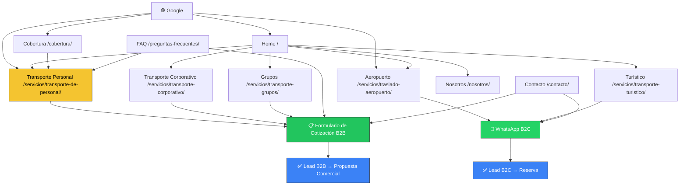

# PRD v2 — Mayhil Express

**Tipo de proyecto:** Web Corporativa B2B-first
**Cliente:** Mayhil Express
**Contacto:** Iván Mayorga — Director de Operaciones
**Dominio:** mayhilexpress.com
**Fecha:** 2026-06-17
**Versión:** 2.0 — Reescritura post-pivot B2B
**Estado:** Listo para Fase UX/UI
**Producido por:** 01_JEFE_DE_PROYECTO_IA + 03_ARQUITECTO_WEB
**Basado en:** Brief v3.1 — Cerrado · Validado por 02_ESTRATEGA_DE_NEGOCIO

> **Nota de versión:** El PRD v1 posicionaba el traslado aeroportuario como servicio principal y usaba WhatsApp como CTA único. Este PRD v2 corrige ese error estratégico: el 70% de los ingresos proviene del Transporte de Personal para Empresas. Toda la arquitectura ha sido rediseñada en consecuencia.

---

## 1. Resumen Ejecutivo

Mayhil Express es una empresa de movilidad corporativa con 5 años de operación en Lima. Su negocio principal son los contratos de Transporte de Personal para empresas (70% de ingresos), complementado con traslados aeroportuarios (20%) y turismo (10%).

El sitio web tiene un único objetivo estratégico: **generar solicitudes de cotización de Gerentes de RRHH, Administración y Logística** de empresas medianas y grandes en Lima y regiones (Ica, Pisco, Huacho).

La conversión secundaria — contactos B2C por WhatsApp para aeropuerto y turismo — existe pero no puede dominar la arquitectura.

**Arquitectura de conversión objetivo:**

```
[B2B] Google (keyword corporativa)
        ↓
Página Transporte de Personal
        ↓
Diferenciadores: GPS · 24/7 · 17 pax · SEDAPAL/CLARO/MOVISTAR
        ↓
Formulario de cotización empresarial
        ↓
Contacto comercial → Propuesta → Contrato

[B2C] Google (keyword aeropuerto / turismo)
        ↓
Página de servicio específico
        ↓
CTA WhatsApp con mensaje preconfigurado
        ↓
Reserva confirmada
```

---

## 2. Objetivos del Proyecto

### Objetivo principal (SMART)
Generar un mínimo de **3 solicitudes de cotización empresarial por mes** vía formulario B2B durante los primeros 3 meses post-lanzamiento, provenientes de empresas con operaciones en Lima o regiones (Ica, Pisco, Huacho).

### Objetivos secundarios

| Objetivo | Indicador de éxito | Plazo |
|----------|-------------------|-------|
| Posicionar en Google B2B | Top 10 en 2+ keywords corporativas | 90 días |
| Generar contactos B2C | ≥ 10 clics WhatsApp/mes | 30 días |
| Transmitir credibilidad B2B | Sección con SEDAPAL/CLARO/MOVISTAR activa | Lanzamiento |
| Mejorar imagen profesional | Sitio percibido más profesional que 3 competidores | Lanzamiento |
| Cobertura regional visible | Sección de cobertura con Lima + Ica/Pisco/Huacho | Lanzamiento |

---

## 3. Público Objetivo

### Segmento A — Decisor Corporativo (primario · 70% del negocio)

| Campo | Detalle |
|-------|---------|
| Cargo | Gerente de RRHH / Gerente Administrativo / Jefe de Logística |
| Empresa | Mediana o gran empresa en Lima con +30 colaboradores en campo o turnos rotativos |
| Sector | Manufactura, retail, salud, construcción, call centers, servicios |
| Problema | Ausentismo por transporte público, falta de control sobre movilidad del personal |
| Trigger | Incidente con proveedor actual, KPI de asistencia bajo, expansión de operaciones |
| Canal | Google (desktop/móvil), referidos, LinkedIn |
| CTA esperado | **Formulario de cotización empresarial** — no WhatsApp como primer contacto |
| Lo que necesita ver | GPS, referencias corporativas, cobertura geográfica, disponibilidad 24/7 |

### Segmento B — Viajero / Turista (secundario · 30% del negocio)

| Campo | Detalle |
|-------|---------|
| Perfil | Turista nacional/internacional, ejecutivo en tránsito, familia con equipaje |
| Problema | Traslado confiable al/desde Aeropuerto Jorge Chávez o destino turístico |
| Canal | Google (móvil), recomendación de hotel, redes sociales |
| CTA esperado | **WhatsApp directo** con mensaje preconfigurado |

---

## 4. Alcance del Proyecto

### Dentro del alcance — Fase 1

- Sitio web corporativo bilingüe (ES / EN)
- 10 páginas en español + 9 páginas equivalentes en inglés
- Formulario de cotización B2B con campos empresariales
- Widget de WhatsApp flotante con mensajes diferenciados por audiencia
- Sección "Empresas que confían en nosotros" (SEDAPAL/CLARO/MOVISTAR — activar si autorización confirmada; fallback con texto genérico)
- Sección de cobertura geográfica (Lima + Ica, Pisco, Huacho)
- SEO on-page completo con Rank Math
- Google Analytics 4 + Google Tag Manager
- Responsive / mobile-first

### Fuera del alcance — Fase 1

| Exclusión | Razón |
|-----------|-------|
| Ecommerce / tienda online | No requerido por el cliente |
| Pasarela de pago | No aplica al modelo de negocio |
| Sistema de reservas automático | El proceso es cotización → propuesta → contrato |
| Área privada o login | No requerido |
| CRM | No requerido en fase 1 |
| Blog | Fase 2 — opcional |
| Landing pages para Ads | Fase 2 — opcional |

---

## 5. Sitemap

### Versión Español (principal)

```
/                                          → Inicio
├── /nosotros/                             → Nosotros
├── /servicios/
│   ├── /servicios/transporte-de-personal/ → Transporte de Personal ★ CRÍTICA
│   ├── /servicios/transporte-corporativo/ → Transporte Corporativo / Ejecutivo
│   ├── /servicios/traslado-aeropuerto/    → Traslado al Aeropuerto
│   ├── /servicios/transporte-turistico/   → Transporte Turístico
│   └── /servicios/transporte-grupos/      → Transporte para Grupos
├── /cobertura/                            → Zonas de Cobertura ★ NUEVA
├── /preguntas-frecuentes/                 → Preguntas Frecuentes
└── /contacto/                             → Contacto
```

**Total ES: 10 páginas**

### Versión Inglés (secundaria)

```
/en/                                       → Home
├── /en/about/                             → About Us
├── /en/services/
│   ├── /en/services/staff-transport/      → Staff Transport ★ CRITICAL
│   ├── /en/services/airport-transfer/     → Airport Transfer
│   └── /en/services/tour-transport/       → Tour Transport
├── /en/coverage/                          → Coverage Areas
├── /en/faq/                               → FAQ
└── /en/contact/                           → Contact
```

**Total EN: 9 páginas**

> **Decisión arquitectónica:** La versión EN es más compacta. Transporte Corporativo y para Grupos se fusionan en un Staff Transport ampliado para simplificar la estructura en inglés y concentrar la autoridad SEO en una sola página.

---

## 6. Especificación de Páginas

### 6.1 Inicio (`/`)

**Propósito:** Capturar la intención B2B en los primeros 5 segundos y dirigir al formulario de cotización.

| # | Sección | Contenido | CTA |
|---|---------|-----------|-----|
| 1 | Hero B2B | Headline: propuesta de valor corporativa · Subheadline: GPS / 24/7 / 17 pax / Lima + regiones · Foto del H350 | "Solicitar cotización empresarial" → formulario |
| 2 | Barra de confianza | Íconos: Monitoreo GPS · Disponible 24/7 · 17 Pasajeros · Lima + Ica · Pisco · Huacho | — |
| 3 | Servicios (resumen) | 5 tarjetas en orden B2B-first: Personal → Corporativo → Aeropuerto → Turístico → Grupos | "Ver servicio" → página respectiva |
| 4 | Diferenciadores | 5–6 pilares con ícono: GPS en tiempo real · Capacidad grupal · Disponibilidad 24/7 · Cobertura regional · Sin permanencia mínima · Atención bilingüe | — |
| 5 | Empresas que confían | Logos: SEDAPAL · CLARO · MOVISTAR *(activar si autorización confirmada)* · Fallback: "Empresas del sector telecomunicaciones y servicios públicos" | — |
| 6 | Formulario de cotización B2B | Formulario embebido con campos empresariales (ver sección 7.1) | "Enviar solicitud" |
| 7 | Flota | Foto real del H350 interior/exterior · Ficha: 17 pax, A/C, WiFi, GPS, maletero amplio | — |
| 8 | Cobertura (resumen) | Mapa o listado: Lima completo + Ica · Pisco · Huacho y periferias | "Ver cobertura completa" → /cobertura/ |
| 9 | CTA final B2C | Bloque secundario para aeropuerto/turismo · WhatsApp | "Consultar por WhatsApp" |

---

### 6.2 Nosotros (`/nosotros/`)

**Propósito:** Construir confianza institucional y transmitir solidez como proveedor B2B.

| Sección | Contenido |
|---------|-----------|
| Historia | 5 años de operación · Origen · Misión: garantizar que el personal de las empresas llega a tiempo |
| Nuestra flota | Hyundai H350: ficha técnica · fotos reales · capacidad · GPS · A/C · WiFi · maletero |
| Misión y valores | Puntualidad · Seguridad · Control · Trazabilidad · Atención 24/7 |
| Nuestros diferenciales | GPS · Cobertura regional · Referencias corporativas · Por viaje sin permanencia mínima |
| CTA | "¿Necesitas transportar a tu personal? Solicita cotización" → formulario |

---

### 6.3 Transporte de Personal (`/servicios/transporte-de-personal/`) ★

**Prioridad: CRÍTICA. Página de mayor inversión de contenido y SEO.**

**Keyword principal:** `transporte de personal lima`
**Keywords secundarias:** `empresa de transporte de personal`, `transporte empresarial lima`, `movilidad para empresas lima`, `transporte de personal Lima Ica`, `transporte de personal Lima Pisco`

| # | Sección | Contenido | CTA |
|---|---------|-----------|-----|
| 1 | Hero | "Transportamos a tu personal con puntualidad, seguridad y control" · Foto H350 con empleados | "Solicitar cotización" → formulario |
| 2 | Propuesta de valor | Elimina el ausentismo causado por transporte público · Garantiza puntualidad · 24/7 para turnos rotativos | — |
| 3 | GPS — diferenciador central | Bloque destacado: monitoreo en tiempo real · seguimiento de rutas · reporte de servicio | — |
| 4 | Capacidad y flota | Hasta 17 colaboradores en un solo vehículo · cobertura de zona industrial o planta | — |
| 5 | Cobertura | Lima (todos los distritos) · Ica · Pisco · Huacho y periferias · mapa o listado visual | — |
| 6 | Modelo de contratación | Por viaje — sin permanencia mínima · Sin riesgo de entrada · "Prueba el servicio sin compromisos" | — |
| 7 | Empresas que confían | SEDAPAL · CLARO · MOVISTAR *(activar si autorización confirmada)* | — |
| 8 | ¿Cómo funciona? | Paso 1: Solicitar cotización → Paso 2: Propuesta a medida → Paso 3: Primer servicio | — |
| 9 | Objeciones frecuentes | ¿Qué pasa si el vehículo falla? · ¿Tienen facturación formal? · ¿Cubren mi zona? | — |
| 10 | Formulario de cotización B2B | Formulario completo con campos empresariales (ver sección 7.1) | "Enviar solicitud de cotización" |

---

### 6.4 Transporte Corporativo / Ejecutivo (`/servicios/transporte-corporativo/`)

**Keyword principal:** `transporte corporativo lima`

| Sección | Contenido |
|---------|-----------|
| Hero | Movilidad ejecutiva para empresas · eventos · reuniones · visitas de clientes |
| Servicios incluidos | Traslados a reuniones · eventos corporativos · visitas a clientes · aeropuerto para ejecutivos |
| Flota | H350 · discreción · puntualidad · imagen corporativa |
| Ventajas | Conductor profesional · sin estacionamientos · puntualidad garantizada |
| CTA | "Coordinar traslado corporativo" → formulario |

---

### 6.5 Traslado al Aeropuerto (`/servicios/traslado-aeropuerto/`)

**Keyword principal:** `traslado aeropuerto lima`
**Keywords secundarias:** `van aeropuerto lima`, `transporte aeropuerto jorge chavez`

| Sección | Contenido |
|---------|-----------|
| Hero | Llega al aeropuerto sin estrés · puntual y cómodo |
| Descripción | Aeropuerto Internacional Jorge Chávez · salidas y llegadas · 24/7 |
| ¿Cómo funciona? | Reserva → Confirmación → Recojo en domicilio → Llegada puntual |
| Para quién | Familias · grupos · ejecutivos · turistas · equipaje voluminoso |
| Características del vehículo | H350 · 17 pasajeros · A/C · WiFi · maletero amplio |
| CTA | "Reservar traslado por WhatsApp" → WhatsApp con mensaje preconfigurado B2C |

---

### 6.6 Transporte Turístico (`/servicios/transporte-turistico/`)

**Keyword principal:** `transporte turístico lima`

| Sección | Contenido |
|---------|-----------|
| Hero | Explora Lima y sus alrededores en privado · vehículo exclusivo para tu grupo |
| Destinos | Lima ciudad · Paracas · Huacachina (Ica) · Pisco · Chincha · PENDIENTE DE VALIDACIÓN |
| Características | Vehículo privado · A/C · WiFi · capacidad hasta 17 pasajeros |
| Ideal para | Grupos familiares · turistas · agencias de viaje · hoteles |
| CTA | "Planifica tu ruta por WhatsApp" → WhatsApp B2C |

---

### 6.7 Transporte para Grupos (`/servicios/transporte-grupos/`)

**Keyword principal:** `transporte privado grupos lima`

| Sección | Contenido |
|---------|-----------|
| Hero | Un solo vehículo · hasta 17 pasajeros · sin dividir el grupo |
| Casos de uso | Eventos · graduaciones · excursiones · cumpleaños · salidas de empresa |
| Ventajas | Precio único · espacio para equipaje · sin dividir el grupo · privado |
| Capacidad | Hasta 17 pasajeros — ningún competidor estándar iguala este número en van privada |
| CTA | "Cotizar para mi grupo" → formulario (campo: cantidad de personas) |

---

### 6.8 Zonas de Cobertura (`/cobertura/`) ★ NUEVA

**Propósito:** Resolver la objeción #1 de decisores B2B — "¿cubren la zona donde opero?"

| Sección | Contenido |
|---------|-----------|
| Intro | "Cubrimos toda Lima y llegamos hasta donde tu empresa opera" |
| Lima — todos los distritos | Listado o mapa visual de todos los distritos de Lima Metropolitana |
| Cobertura regional | Ica · Pisco · Huacho · periferias — destacar como diferenciador |
| Casos de uso por región | Ica: agroindustria, agroexportación · Pisco: pesca, industria · Huacho: manufactura, industria |
| Turismo regional | Paracas · Huacachina · rutas interprovinciales |
| ¿Mi zona no aparece? | "Consúltanos — operamos a medida de tu empresa" → formulario |

---

### 6.9 Preguntas Frecuentes (`/preguntas-frecuentes/`)

**Propósito:** Resolver objeciones B2B y B2C, reducir fricción y aportar contenido SEO de cola larga.

**FAQs propuestas — B2B (prioritarias):**

1. ¿Qué tipo de empresas contratan el servicio de transporte de personal?
2. ¿Cuál es el modelo de contratación? ¿Debo firmar un contrato mínimo?
3. ¿Cuántas personas puede transportar el vehículo?
4. ¿Ofrecen monitoreo GPS de las rutas?
5. ¿Cuál es el tiempo de respuesta para una cotización?
6. ¿Qué zonas cubren fuera de Lima?
7. ¿Tienen disponibilidad para turnos nocturnos o fines de semana?
8. ¿Emiten facturas y tienen RUC activo?

**FAQs propuestas — B2C (complementarias):**

9. ¿Con cuánta anticipación debo reservar mi traslado al aeropuerto?
10. ¿El servicio funciona las 24 horas?
11. ¿Cuánto equipaje puedo llevar?
12. ¿Tienen atención en inglés?

*Lista a validar y completar con el cliente antes del desarrollo.*

---

### 6.10 Contacto (`/contacto/`)

**Propósito:** Canalizar leads B2B al formulario y leads B2C al WhatsApp.

| Elemento | Detalle |
|----------|---------|
| Hero | "¿Necesitas transportar a tu equipo? Contáctanos" |
| Formulario B2B | Formulario completo de cotización empresarial (ver sección 7.1) |
| WhatsApp B2C | Botón: "¿Traslado al aeropuerto o tour? Escríbenos por WhatsApp" con mensaje preconfigurado B2C |
| Email | servicio@mayhilexpress.com |
| Teléfono | +51 941 747 096 |
| Horario | Disponibles 24 horas · 365 días del año |
| Dirección | PENDIENTE DE VALIDACIÓN |

---

## 7. Funcionalidades

### 7.1 Formulario de Cotización B2B (PRIORITARIO)

El formulario es la funcionalidad más crítica del sitio. Debe recoger datos que permitan elaborar una propuesta comercial sin necesidad de una llamada previa.

**Campos obligatorios:**

| Campo | Tipo | Ejemplo |
|-------|------|---------|
| Nombre de la empresa | Texto | "Empresa S.A.C." |
| Nombre del responsable | Texto | "Juan Pérez" |
| Cargo | Texto | "Gerente de RRHH" |
| Email corporativo | Email | "juan@empresa.com" |
| Teléfono | Teléfono | "+51 9XX XXX XXX" |
| Cantidad de personas a transportar | Número o selector | 1–17 / 17+ |
| Zona o distritos de recojo | Texto libre | "Chorrillos, Lurín" |
| Zona o distritos de destino | Texto libre | "San Isidro, Miraflores" |
| Frecuencia estimada | Selector | Diario / Semanal / Puntual / Por definir |
| Horario aproximado | Texto | "6:00 AM y 10:00 PM" |
| Mensaje adicional | Textarea | — |

**Herramienta:** Fluent Forms (o Contact Form 7 como alternativa)
**Destino de envío:** Email a servicio@mayhilexpress.com + notificación WhatsApp al Director de Operaciones
**Confirmación al lead:** Email automático de acuse de recibo

---

### 7.2 Tabla de Funcionalidades

| Funcionalidad | Prioridad | Herramienta | Fase |
|---------------|-----------|-------------|------|
| Formulario de cotización B2B | **CRÍTICA** | Fluent Forms | 1 |
| Widget WhatsApp flotante — B2C | Alta | WP Social Chat | 1 |
| WhatsApp mensaje B2B diferenciado | Alta | WP Social Chat | 1 |
| Multiidioma ES / EN | Alta | WPML o Polylang | 1 |
| Galería de flota con especificaciones | Alta | Elementor Gallery | 1 |
| Sección "Empresas que confían" | Alta (condicional) | Elementor | 1 |
| Sección de cobertura con mapa/listado | Alta | Elementor + Google Maps embed | 1 |
| SEO on-page por página | Alta | Rank Math | 1 |
| Schema markup LocalBusiness + TransportService | Alta | Rank Math | 1 |
| Google Analytics 4 | Alta | GTM | 1 |
| Google Tag Manager | Alta | Plugin GTM | 1 |
| Tracking de eventos: formulario + WhatsApp | Alta | GTM | 1 |
| Responsive / mobile-first | Alta | Elementor Pro | 1 |
| Velocidad: Core Web Vitals | Alta | LiteSpeed Cache + Cloudflare | 1 |
| Blog | No | — | 2 |
| Landing Ads | No | — | 2 |
| Ecommerce | No | — | — |
| Reservas automáticas | No | — | — |
| Pasarela de pago | No | — | — |
| Área privada | No | — | — |

---

## 8. Arquitectura de Conversión

### Flujo B2B (primario)

```
1. Usuario busca en Google: "transporte de personal lima"
2. Encuentra /servicios/transporte-de-personal/ (o Home)
3. Ve diferenciadores: GPS · SEDAPAL/CLARO/MOVISTAR · Cobertura Lima + regiones
4. Descubre modelo por viaje: sin permanencia mínima — barrera baja
5. Completa formulario de cotización empresarial
6. Recibe email de confirmación automático
7. Mayhil Express responde con propuesta en ≤24h
8. Cierre de primer viaje → relación recurrente
```

### Flujo B2C (secundario)

```
1. Usuario busca en Google: "traslado aeropuerto lima" / "transporte turístico"
2. Encuentra página de servicio específico
3. Ve características del vehículo y horario 24/7
4. Hace clic en botón WhatsApp (mensaje preconfigurado B2C)
5. Confirma reserva por WhatsApp en minutos
```

### Mensajes WhatsApp preconfigurados

**Widget B2B:**
```
Hola, soy [nombre] de [empresa]. Me gustaría solicitar una cotización para 
transporte de personal. ¿Me pueden contactar?
```

**Widget B2C (aeropuerto / turismo):**
```
Hola, me gustaría cotizar un traslado al aeropuerto / tour. ¿Tienen disponibilidad?
```

### CTAs por audiencia

| Audiencia | CTA primario | CTA secundario |
|-----------|-------------|----------------|
| B2B (Empresas) | "Solicitar cotización empresarial" → formulario | "Consultar por WhatsApp" |
| B2C (Viajeros) | "Reservar por WhatsApp" → WhatsApp | Formulario de contacto |

---

## 9. Branding y Estilo

| Elemento | Especificación |
|----------|---------------|
| Colores | Amarillo · Negro · Blanco (confirmados con el cliente) |
| Amarillo | CTAs, botones, acentos, íconos de diferenciadores |
| Negro | Navbar, fondos premium, texto principal |
| Blanco | Fondos de sección, tarjetas, espaciado |
| Tipografía | PENDIENTE DE VALIDACIÓN — sugerido: Montserrat (títulos) + Inter (cuerpo) |
| Fotografías | Fotos reales del H350 disponibles — usar en hero, páginas de servicio y galería |
| Videos | PENDIENTE DE VALIDACIÓN — recomendado para página de Transporte de Personal |
| Tono B2B | Directo · orientado a resultados · lenguaje de negocios |
| Tono B2C | Cercano · confiable · claro · seguro |
| Estilo visual | Profesional · Corporativo · Moderno — sin ilustraciones · íconos lineales |

---

## 10. Arquitectura SEO

### Clusters de keywords

#### Cluster 1 — Transporte de Personal (CORE — página pilar)

| Keyword | Tipo | Página objetivo |
|---------|------|----------------|
| transporte de personal lima | Comercial alta intención | /servicios/transporte-de-personal/ |
| empresa de transporte de personal | Comercial | /servicios/transporte-de-personal/ |
| transporte empresarial lima | Comercial | /servicios/transporte-de-personal/ |
| movilidad para empresas lima | Comercial | /servicios/transporte-de-personal/ |
| servicio de transporte de personal | Informacional | /servicios/transporte-de-personal/ |
| transporte de personal Lima Ica | Regional B2B | /servicios/transporte-de-personal/ + /cobertura/ |
| transporte de personal Lima Pisco | Regional B2B | /servicios/transporte-de-personal/ + /cobertura/ |
| transporte de personal Lima Huacho | Regional B2B | /servicios/transporte-de-personal/ + /cobertura/ |

#### Cluster 2 — Transporte Corporativo / Ejecutivo

| Keyword | Tipo | Página objetivo |
|---------|------|----------------|
| transporte corporativo lima | Comercial | /servicios/transporte-corporativo/ |
| transporte ejecutivo lima | Comercial | /servicios/transporte-corporativo/ |

#### Cluster 3 — Aeropuerto y Turismo (secundario)

| Keyword | Tipo | Página objetivo |
|---------|------|----------------|
| traslado aeropuerto lima | Comercial | /servicios/traslado-aeropuerto/ |
| van aeropuerto lima | Comercial | /servicios/traslado-aeropuerto/ |
| transporte aeropuerto jorge chavez | Comercial | /servicios/traslado-aeropuerto/ |
| transporte turístico lima | Comercial | /servicios/transporte-turistico/ |

#### Cluster 4 — Cobertura Regional (oportunidad diferencial)

| Keyword | Tipo | Página objetivo |
|---------|------|----------------|
| transporte empresarial Lima Ica | Regional | /cobertura/ |
| traslado Lima Ica empresas | Regional | /cobertura/ |
| van Lima Ica | Regional | /cobertura/ |
| transporte Lima Pisco | Regional | /cobertura/ |
| transporte Lima Huacho empresas | Regional | /cobertura/ |

### Configuración técnica — Rank Math

| Elemento | Detalle |
|----------|---------|
| Schema markup | `LocalBusiness` + `TransportService` en Home |
| Schema markup por servicio | `Service` en cada página de servicio |
| Schema markup FAQ | `FAQPage` en /preguntas-frecuentes/ |
| Meta titles | Únicos por página · keyword principal al inicio |
| Meta descriptions | Únicas · CTA incluido · ≤ 160 caracteres |
| Open Graph | Imagen destacada + título + descripción por página |
| Breadcrumbs | Activados en subpáginas de servicios |
| Sitemap XML | Generado automáticamente · enviar a Search Console |
| Canonicals | Configurados para evitar duplicación ES/EN |
| Alt text | En todas las imágenes del sitio |

### Enlazado interno estratégico

```
Home → Transporte de Personal (enlace destacado en hero y sección servicios)
Home → Cobertura (enlace desde sección diferenciadores)
Transporte de Personal → Cobertura (enlace interno)
Transporte Personal → Transporte Corporativo (enlace sugerido al pie)
FAQ → Transporte de Personal (enlace desde preguntas B2B)
Contacto → Transporte de Personal (enlace de texto ancla)
```

---

## 11. Stack Tecnológico

| Capa | Herramienta | Justificación |
|------|-------------|---------------|
| CMS | WordPress | Requerido por el cliente |
| Page Builder | Elementor Pro | Requerido por el cliente |
| SEO | Rank Math | Requerido por el cliente |
| Formularios | Fluent Forms | Campos personalizados B2B · notificaciones configurables |
| Multiidioma | WPML (preferido) o Polylang | Compatibilidad con Elementor Pro |
| WhatsApp widget | WP Social Chat | Mensajes diferenciados por página / audiencia |
| Analytics | Google Analytics 4 (vía GTM) | Tracking de eventos B2B (formulario + WhatsApp) |
| Tag Manager | Google Tag Manager | Gestión de tags sin tocar código |
| CDN / Seguridad | Cloudflare (plan Free o Pro) | Performance y protección |
| Caché / Performance | LiteSpeed Cache | Core Web Vitals en hosting compartido |
| Tipos de contenido | ACF (Advanced Custom Fields) | Para galería de flota y datos estructurados de servicios |

---

## 12. Integraciones

| Integración | Prioridad | Estado | Requiere acción del cliente |
|-------------|-----------|--------|-----------------------------|
| Google Analytics 4 | Alta | Pendiente | Sí — crear cuenta o dar acceso |
| Google Search Console | Alta | Pendiente | Sí — verificar dominio |
| Google Tag Manager | Alta | Pendiente | Sí — crear contenedor o dar acceso |
| Google Business Profile | Alta | PENDIENTE DE VALIDACIÓN | Sí — crear o dar acceso |
| WhatsApp Business (+51 941 747 096) | Alta | Confirmar número activo | Confirmar número |
| Google Maps (embed cobertura) | Media | Pendiente | No — gestión agencia |
| Email (notificaciones formulario) | Alta | Pendiente | Confirmar email destino |
| Meta Pixel | Baja | Fuera de alcance fase 1 | — |

---

## 13. Contenido Requerido del Cliente

**El cliente debe proveer los siguientes materiales antes del inicio del diseño:**

| Material | Estado | Prioridad | Impacto |
|----------|--------|-----------|---------|
| Logo en alta resolución (PNG / SVG) | **Disponible** | Alta | Identidad visual |
| Fotografías reales del H350 (exterior e interior) | **Disponible** | Alta | Hero, servicios, flota |
| Autorización de SEDAPAL, CLARO, MOVISTAR | **PENDIENTE** | **Alta** | Sección "Empresas que confían" |
| Textos de servicios validados o a redactar | Pendiente | Alta | Copy de todas las páginas |
| Lista de distritos y regiones que cubren (Lima + regiones) | Confirmada en Brief | Alta | Página /cobertura/ |
| Dirección o zona de operación en Lima | Pendiente | Media | Página /contacto/ — mapa |
| Testimonios o frases de clientes corporativos | Pendiente | Media | Sección social proof |
| Destinos turísticos frecuentes | Pendiente | Media | Página /transporte-turistico/ |
| Precios o rangos de tarifa (B2C) | Pendiente | Media | FAQ + página aeropuerto |
| Videos del vehículo o servicio | Pendiente | Baja | Conversión B2B |
| Tipografía de marca definida | Pendiente | Baja | Design system |
| Manual de marca | Pendiente | Baja | Guía visual |

**Nota crítica:** Si la autorización de SEDAPAL, CLARO y MOVISTAR no llega antes del lanzamiento, la sección "Empresas que confían en nosotros" debe usar el fallback: *"Empresas del sector telecomunicaciones y servicios públicos con operaciones en Lima"*. No publicar nombres sin autorización escrita.

---

## 14. Arquitectura — Diagrama Mermaid



---

## 15. KPIs y Criterios de Éxito

### KPIs de conversión B2B (primarios)

| KPI | Meta mes 1 | Meta mes 3 |
|-----|-----------|-----------|
| Formularios de cotización enviados | ≥ 3 | ≥ 10 |
| Propuestas comerciales generadas | ≥ 1 | ≥ 4 |
| Tasa formulario completado / visita | ≥ 2% | ≥ 3% |

### KPIs de conversión B2C (secundarios)

| KPI | Meta mes 1 | Meta mes 3 |
|-----|-----------|-----------|
| Clics al botón WhatsApp | ≥ 15 | ≥ 50 |
| Tasa clic WhatsApp / visita | ≥ 3% | ≥ 5% |

### KPIs de SEO

| KPI | Meta mes 3 |
|-----|-----------|
| Keywords B2B en top 10 Google | ≥ 2 |
| Keywords regionales en top 20 | ≥ 3 |
| Tráfico orgánico mensual | ≥ 300 sesiones |
| Core Web Vitals — LCP | < 2.5s |
| Core Web Vitals — CLS | < 0.1 |

### Criterios de éxito del proyecto

1. El sitio genera al menos 1 cotización B2B formal en los primeros 30 días
2. La página `/servicios/transporte-de-personal/` posiciona en Google para 1+ keyword B2B en 90 días
3. La sección de cobertura geográfica (Lima + regiones) está publicada y visible al lanzamiento
4. La sección "Empresas que confían en nosotros" está activa (con logos o con fallback texto) al lanzamiento
5. El formulario de cotización está operativo y llega al email de Iván Mayorga sin fallo
6. Google PageSpeed Score ≥ 75 en móvil
7. El sitio es 100% funcional en iOS y Android

---

## 16. Restricciones y Dependencias

| Item | Detalle |
|------|---------|
| CMS obligatorio | WordPress |
| Page builder obligatorio | Elementor Pro |
| SEO obligatorio | Rank Math |
| Stack excluido | Ecommerce · pasarela de pago · reservas automáticas · área privada |
| Idioma principal | Español |
| Idioma secundario | Inglés |
| Dominio | mayhilexpress.com |
| País objetivo principal | Lima, Perú |
| Países/regiones secundarias | Ica, Pisco, Huacho |
| Hosting | PENDIENTE DE VALIDACIÓN |
| Presupuesto | PENDIENTE DE VALIDACIÓN |
| Fecha de entrega | PENDIENTE DE VALIDACIÓN |
| Dependencia crítica | Autorización de SEDAPAL/CLARO/MOVISTAR para sección social proof |

---

## 17. Riesgos del Proyecto

| Riesgo | Probabilidad | Impacto | Mitigación |
|--------|--------------|---------|------------|
| Cliente no entrega materiales a tiempo | Alta | Alto | Solicitar todo antes de iniciar diseño; bloquear inicio si falta logo o fotos |
| Autorización SEDAPAL/CLARO/MOVISTAR no llega a tiempo | Media | Alto | Preparar fallback con texto genérico — no retrasar lanzamiento por este elemento |
| Textos no validados por el cliente | Media | Medio | Redactar desde la agencia, marcar con [PENDIENTE VALIDACIÓN] y solicitar aprobación escrita |
| Hosting inadecuado para WordPress+Elementor | Media | Alto | Confirmar hosting antes de instalar — mínimo 2GB RAM, PHP 8.1 |
| Accesos a dominios, hosting o Google no entregados | Media | Alto | Solicitar todos los accesos en sesión de onboarding antes de comenzar |
| Cambios de alcance no documentados | Alta | Medio | Definir scope sign-off formal antes de desarrollo |
| SEO sin resultados en 60 días | Alta | Bajo | Alinear expectativas: posicionamiento orgánico tarda 3–6 meses mínimo |
| Competidores con más dominio authority | Media | Medio | Compensar con contenido B2B específico y keywords de menor competencia (regionales) |

---

## 18. Entregables

| # | Entregable | Fase | Responsable |
|---|-----------|------|-------------|
| 1 | Sitio web corporativo — 10 páginas ES | 1 | 08_WORDPRESS_DEVELOPER |
| 2 | Versión inglés — 9 páginas EN | 1 | 08_WORDPRESS_DEVELOPER |
| 3 | Formulario de cotización B2B operativo | 1 | 08_WORDPRESS_DEVELOPER |
| 4 | Widget WhatsApp configurado (B2B y B2C) | 1 | 08_WORDPRESS_DEVELOPER |
| 5 | Sección "Empresas que confían en nosotros" | 1 | 08_WORDPRESS_DEVELOPER |
| 6 | Página de cobertura geográfica con mapa | 1 | 08_WORDPRESS_DEVELOPER |
| 7 | SEO on-page completo con Rank Math | 1 | 08_WORDPRESS_DEVELOPER |
| 8 | Schema markup LocalBusiness + Service | 1 | 08_WORDPRESS_DEVELOPER |
| 9 | GA4 + GTM instalados y configurados | 1 | 08_WORDPRESS_DEVELOPER |
| 10 | Tracking de eventos: formulario + WhatsApp | 1 | 08_WORDPRESS_DEVELOPER |
| 11 | Sitemap XML enviado a Search Console | 1 | 08_WORDPRESS_DEVELOPER |
| 12 | Sitio responsive y mobile-first | 1 | 08_WORDPRESS_DEVELOPER |
| 13 | QA completo | 1 | 10_QA_MANTENIMIENTO |
| 14 | Deploy a producción | 1 | 11_DEVOPS_DEPLOYMENT |
| 15 | Blog (primeros posts SEO B2B) | 2 | 08_WORDPRESS_DEVELOPER |
| 16 | Landing pages para Google Ads B2B | 2 | 08_WORDPRESS_DEVELOPER |

---

## 19. Tiempo Estimado

| Fase | Actividad | Días hábiles |
|------|-----------|:---:|
| 1 | Setup: WordPress + Elementor Pro + plugins base + configuración SEO inicial | 1 |
| 2 | Diseño y desarrollo: Home (todas las secciones incluyendo formulario y social proof) | 2–3 |
| 3 | Diseño y desarrollo: Transporte de Personal (página crítica — máxima inversión) | 1–2 |
| 4 | Diseño y desarrollo: Nosotros + Cobertura + FAQ + Contacto | 2 |
| 5 | Diseño y desarrollo: 4 páginas de servicio restantes (Corporativo, Aeropuerto, Turístico, Grupos) | 2 |
| 6 | Multiidioma — versión EN completa | 2 |
| 7 | SEO on-page: meta titles, descriptions, schema markup, breadcrumbs, alt text | 1 |
| 8 | Integraciones: GA4, GTM, tracking formulario + WhatsApp, Search Console | 1 |
| 9 | QA: responsive, velocidad, formulario, cross-browser, enlazado interno | 1 |
| 10 | Correcciones y entrega final | 1 |
| **Total** | | **~14 días hábiles** |

---

## 20. Agentes Involucrados

| Agente | Rol | Fase |
|--------|-----|------|
| 02_ESTRATEGA_DE_NEGOCIO | Completado — Brief v3.1 entregado | ✅ |
| 01_JEFE_DE_PROYECTO_IA | Coordinación y PRD | ✅ |
| 03_ARQUITECTO_WEB | Arquitectura y PRD | ✅ |
| 04_UX_UI_DESIGNER | Wireframes y design system | **Siguiente** |
| 05_COPYWRITER_WEB | Copy Home, Transporte Personal, servicios, FAQs, EN | Fase 3 |
| 06_EXPERTO_SEO | Keyword research final, arquitectura SEO, plan de contenidos | Fase 3 |
| 08_WORDPRESS_DEVELOPER | Desarrollo completo | Fase 4 |
| 10_QA_MANTENIMIENTO | Testing y correcciones | Fase 5 |
| 11_DEVOPS_DEPLOYMENT | Deploy y configuración de producción | Fase 6 |

---

## 21. Próximos Pasos

### Inmediatos (antes de diseño)

1. **[CRÍTICO]** Confirmar autorización de SEDAPAL, CLARO y MOVISTAR para uso de nombre y logo en el sitio
2. Validar este PRD v2 con Iván Mayorga — Director de Operaciones
3. Confirmar hosting: proveedor, plan y accesos
4. Confirmar dominio mayhilexpress.com: acceso y estado de renovación
5. Crear o compartir accesos a Google Analytics, Search Console y GTM
6. Entregar materiales pendientes: textos, dirección, precios orientativos para B2C, destinos turísticos

### Siguiente fase del sistema

Pasar el proyecto al agente **04_UX_UI_DESIGNER** con este PRD v2 como input.

Entregables esperados del UX/UI:
- Wireframes de Home (todas las secciones)
- Wireframe de `/servicios/transporte-de-personal/`
- Wireframe del formulario de cotización B2B
- Design System: colores, tipografía, botones, íconos

---

## Checklist de Validación — JEFE DE PROYECTO + ARQUITECTO WEB

- [x] Objetivos SMART definidos
- [x] Alcance definido (dentro y fuera de scope)
- [x] Brief v3.1 respetado completamente
- [x] Posicionamiento B2B-first reflejado en toda la arquitectura
- [x] Buyer Persona A (decisor corporativo) como audiencia primaria
- [x] Formulario de cotización B2B como CTA primario
- [x] WhatsApp como CTA secundario (B2C)
- [x] Transporte de Personal como página crítica en sitemap
- [x] Cobertura regional (Lima + Ica/Pisco/Huacho) como página independiente
- [x] Sección "Empresas que confían" planificada con fallback
- [x] SEO por clusters (B2B, corporativo, aeropuerto, regional)
- [x] Enlazado interno estratégico definido
- [x] Stack tecnológico definido (WordPress + Elementor Pro + Rank Math)
- [x] Integraciones definidas
- [x] Funcionalidades priorizadas
- [x] Riesgos identificados y mitigación planificada
- [x] KPIs medibles definidos
- [x] Tiempo estimado calculado (~14 días hábiles)
- [x] Agentes del sistema asignados
- [x] Próximos pasos definidos
- [ ] Validación formal del cliente pendiente
- [ ] Autorización SEDAPAL/CLARO/MOVISTAR pendiente

---

*Documento producido por 01_JEFE_DE_PROYECTO_IA + 03_ARQUITECTO_WEB · IA-WEB-STUDIO-OS · Mayhil Express · 2026-06-17 · Versión 2.0*
